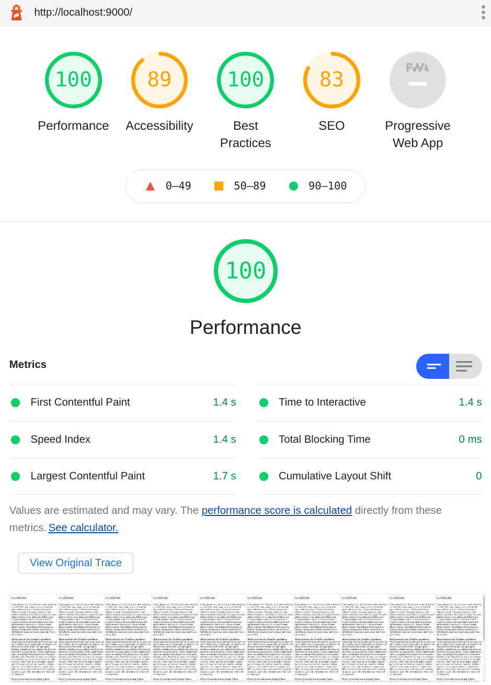
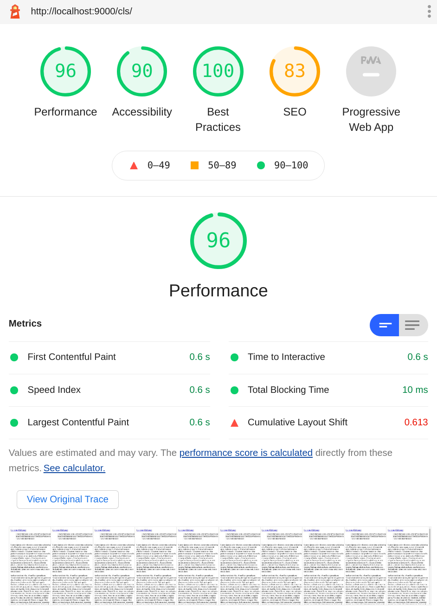

## Description

There's a weird CLS issue reported by Lighthouse (tested on v7.0.0) when
a page is rendering some content before `StaticImage` (or `GatsbyImage`)
(from `gatsby-plugin-image`), which gets reordered via a CSS grid or
flexbox.

After falling down a few rabbit holes I stumbled upon a stackoverflow
question talking about bootstrap grid, but it seemed similiar to the
issue I was having, because it was changing the order of HTML nodes via
CSS. [The answer to the question sheds some
light](https://stackoverflow.com/a/64194062), and I think it's the same
[Chromium
bug](https://bugs.chromium.org/p/chromium/issues/detail?id=1041006) to
blame where the browser's parser yields and triggers rendering after
encountering a `<script>` tag after reading 50 tokens.

I checked the source for `gatsby-plugin-image` looking for any script
tags, and there's [one in the `layout-wrapper`
component](https://github.com/gatsbyjs/gatsby/blob/54d4721462b9303fed723fdcb15ac5d72e103778/packages/gatsby-plugin-image/src/components/layout-wrapper.tsx#L107)
(rendered server-side).

This reproducible test case contains two pages: one where there's an
image with few nodes before it, and another one where there's way more
(50+) nodes before. The former gets a 0 CLS score while the latter gets
a larger CLS score.

I understand it's not really a `gatsby-plugin-image` bug, but rather one
in chromium, but maybe it would make sense to work around it? I'm not
sure how exactly, but I figure that moving the `<script>` to the bottom
of the page (instead of right after the ``) would work.

### Steps to reproduce

1.  Clone the repo, build the project, and serve it.

    ```shell
    npm install && npm run build && npm run serve
    ```

2.  Open the page at root (`/`) in Google Chrome and do a mobile Lighthouse run.

3.  Go to the `/cls` page and do a mobile Lighthouse run again.

### Expected result

Both Lighthouse runs should report a CLS of 0.

### Actual result

The `/cls` page reports a CLS that's considerably larger than 0. If it
doesn't happen, run lighthouse again. In my experience it took me 3
tries at most to get the larger-than-0 result. Usually I get it on the
first run.

### Environment

Machine #1

```
  System:
    OS: Linux 4.15 Ubuntu 18.04.5 LTS (Bionic Beaver)
    CPU: (4) x64 Intel(R) Core(TM) i5-6600K CPU @ 3.50GHz
    Shell: 5.4.2 - /usr/bin/zsh
  Binaries:
    Node: 14.16.0 - ~/.nvm/versions/node/v14.16.0/bin/node
    npm: 7.8.0 - ~/.nvm/versions/node/v14.16.0/bin/npm
  Languages:
    Python: 2.7.17 - /usr/bin/python
  Browsers:
    Chrome: 89.0.4389.82
    Firefox: 87.0
  npmPackages:
    gatsby: ^3.2.1 => 3.2.1
    gatsby-plugin-image: ^1.2.0 => 1.2.0
    gatsby-plugin-sharp: ^3.2.0 => 3.2.0
```

Machine #2

```
  System:
    OS: macOS 11.2.3
    CPU: (4) x64 Intel(R) Core(TM) i5-5257U CPU @ 2.70GHz
    Shell: 5.8 - /bin/zsh
  Binaries:
    Node: 14.16.1 - ~/.nvm/versions/node/v14.16.1/bin/node
    Yarn: 1.22.4 - /usr/local/bin/yarn
    npm: 7.8.0 - ~/.nvm/versions/node/v14.16.1/bin/npm
  Languages:
    Python: 2.7.16 - /usr/bin/python
  Browsers:
    Chrome: 89.0.4389.114
    Edge: 89.0.774.68
    Firefox: 81.0.2
    Safari: 14.0.3
  npmPackages:
    gatsby: ^3.2.1 => 3.2.1
    gatsby-plugin-image: ^1.2.0 => 1.2.0
    gatsby-plugin-sharp: ^3.2.0 => 3.2.0
    gatsby-source-filesystem: ^3.2.0 => 3.2.0
```

### Lighthouse Reports

[](lighthouse-reports/no-cls.html)

[](lighthouse-reports/cls.html)
